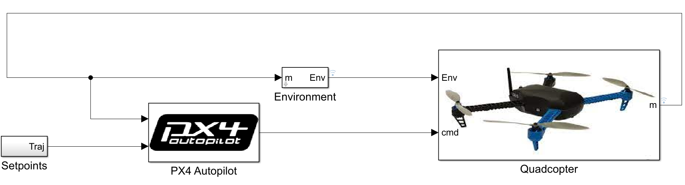

# General Info

This repository contains Simulink models of 6DOF systems based on [px4 autopilot](https://github.com/PX4/PX4-Autopilot) control system.

# Table of contents

1. [Installation](#installation)
2. [6DOF Quadcopter](#6dof-quadcopter)
3. [References](#references)

# Installation

All models built and tested on [Matlab/Simulink](https://www.mathworks.com/products/new_products/latest_features.html) 2023a. 

Clone the repository to your PC, add the folder to Matlab path and open the model.

# 6DOF Quadrotor

* `px4_6dof_quadrotor_simscape.slx` :

The 6DOF model based on [this](https://github.com/mathworks/Quadcopter-Drone-Model-Simscape) Github repository. 

TODO
- [x] Add attitude, position and velocity controllers.
- [x] Convert signals to bus elements.
- [ ] Add INS model.
- [ ] Add EKF based on px4 architecture.
- [ ] Add visualization to the simulation.
- [x] Add motor models instead of the approximate ones.

# References

1. [PX4-Autopilot on github](https://github.com/PX4/PX4-Autopilot)  
2. [PX4 Attitude controller schematics](https://www.researchgate.net/figure/Position-and-attitude-controller-structure-of-a-Px4-based-UAV-33_fig3_341902425)
3. [MAVROS Controllers](https://github.com/Jaeyoung-Lim/mavros_controllers)
4. [Quadrotor plant and control on simulink](http://www.ritravvenlab.com/uploads/1/1/8/4/118484574/ferry.pdf)
5. [Quadcopter-Drone-Model-Simscape](https://github.com/mathworks/Quadcopter-Drone-Model-Simscape)

